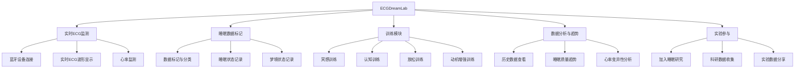
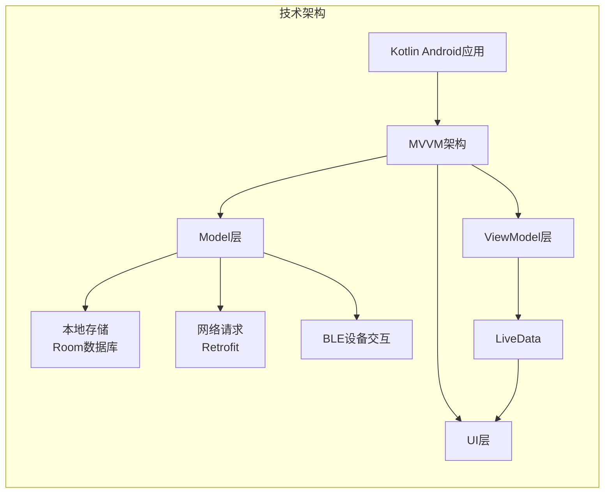

# ECGDreamLab

## 项目简介

ECGDreamLab是一款创新型移动应用，专注于心电图（ECG）数据采集、分析和睡眠健康管理。该应用通过蓝牙连接可穿戴设备，实时监测用户的心电数据，并提供多种功能帮助用户改善睡眠质量和心理健康。

## 功能架构图

## 核心功能

### 实时ECG监测
- 通过蓝牙技术连接可穿戴设备
- 实时采集和显示心电图数据
- 心率实时监测与可视化

### 睡眠数据标记
- 用户可对收集的数据进行标记和分类
- 支持多种睡眠状态和梦境状态的记录
- 数据标记系统便于后续分析和研究

### 训练模块
- 冥想训练
- 认知训练
- 放松训练
- 动机增强训练
- 自定义训练计划

### 数据分析与趋势
- 历史数据查看和分析
- 睡眠质量趋势图
- 心率变异性分析

### 实验参与
- 用户可加入睡眠研究实验
- 支持科研数据收集
- 实验数据管理与分享

## 技术架构

- **蓝牙低功耗技术**：高效连接可穿戴设备
- **实时数据处理**：采用高效算法处理ECG信号
- **用户友好界面**：直观的数据可视化和操作流程
- **安全的用户认证**：保护用户隐私和数据安全
- **本地数据存储**：使用Room数据库进行高效存储
- **网络数据同步**：支持数据云端备份和多设备同步

## 应用场景

- **个人睡眠监测**：帮助用户了解自己的睡眠质量
- **睡眠障碍辅助管理**：为睡眠障碍患者提供数据支持
- **科研数据收集**：支持睡眠和心理健康研究
- **健康生活方式培养**：通过训练模块提升心理健康水平

## 未来展望

- 加入人工智能分析模块，提供个性化睡眠建议
- 扩展社交功能，建立睡眠健康社区
- 开发更多专业训练模块，满足不同用户需求
- 增强与其他健康应用的数据互通性

